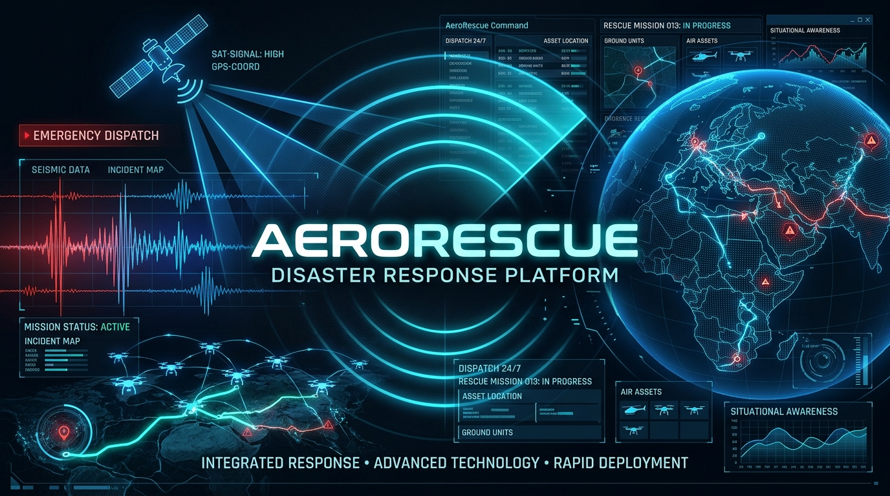

# 🚨 AeroRescue — Real-Time Disaster Needs Dispatch



[](https://www.assemblyai.com/)
[](https://lablab.ai/ai-hackathons/assemblyai-voice-agent-hackathon)
[](https://leafletjs.com/)

> **AeroRescue** is an autonomous, voice-first disaster response and emergency triage platform built for the **[AssemblyAI Voice Agent Hackathon](https://lablab.ai/ai-hackathons/assemblyai-voice-agent-hackathon)**. 
> 
> It transforms chaotic, panicked audio distress calls during natural disasters (earthquakes, floods, cyclones, and wildfires) into organized, prioritized, and actionable rescue intelligence using AssemblyAI's cutting-edge **Voice Agent API** and **Tool Calling**.

---

## 🌍 Live Demo Links

- **Vercel Production (Voice Agent API + Next.js App):** [https://assemblyai-voice-agent.vercel.app](https://assemblyai-voice-agent.vercel.app) *(Requires API Key Config)*
- **Native Builder Mobile App UI (Disaster Report Hub):** [https://c0wme2t9c9cfku83yqo5roibf.nativelyai.app](https://c0wme2t9c9cfku83yqo5roibf.nativelyai.app)
- **Demo Video:** See our Lablab.ai submission for the full visual demo of the agent answering calls and plotting real-time Leaflet maps!

---

## 🚑 The Solution & Core Workflow

During a disaster, emergency phone lines are jammed and victims are panicked. AeroRescue bridges the gap between panicked victims and rescue dispatchers in less than 30 seconds:

1. **Real-Time Voice Agent:** A victim opens AeroRescue on their phone or browser, and speaks naturally to our **AssemblyAI Voice Agent**. The agent acts as a calm, intelligent dispatcher, prompting the victim for crucial information like their location, disaster type, and injuries.
2. **Universal-3 Pro STT Engine:** Accurately converts noisy, high-speed, or breathless emergency audio into clean text transcripts with sub-second latency.
3. **LLM Tool Calling & Extraction:** The Voice Agent's LLM is equipped with a `dispatch_rescue_team` tool. It automatically extracts the victim's location, converts it to geographic coordinates (Latitude/Longitude) on the fly, and triggers the tool.
4. **Live Rescue Map Integration:** On the frontend, the application listens for the tool call over the WebSocket and instantly drops a geographic pin on a live Leaflet map, visualizing the emergency for rescue coordinators.

---

## 🛠️ Technology Stack & Integrations

*   **[AssemblyAI Voice Agent API](https://www.assemblyai.com/):** The core engine of the application. Handles Speech-to-Text, LLM reasoning, Text-to-Speech, and turn-taking in a single WebSocket connection.
*   **JSON-Schema Tool Calling:** We heavily utilize the Voice Agent's tool-calling capabilities to trigger client-side mapping functions based on conversational context.
*   **Leaflet & OpenStreetMap:** Renders the interactive, real-time rescue dispatch map on the frontend.
*   **Python Server:** A lightweight server (`server.py`) using the official AssemblyAI Python SDK to generate ephemeral tokens and serve the client securely.
*   **Vercel / FastAPI:** Refactored backend routes for serverless cloud deployment.

---

## 🌪️ Supported Disaster Scenarios

AeroRescue is engineered to parse different needs profiles across four major climate emergency categories:

| Disaster Type | Primary Hazards | Core AI Extraction Target | Primary Dispatch Unit |
| :--- | :--- | :--- | :--- |
| 🚨 **Earthquake** | Structural collapse, gas leaks, trapped victims | Rubble location, trapped counts, injury severity | USAR Search & Rescue |
| 🌊 **Rain & Flood** | Rising floodwaters, submerged homes | Stranded level (roof/attic), boat requirements | Water Rescue & Boats |
| 🌪️ **Cyclone** | High winds, destroyed shelters, power loss | Evacuation route safety, shelter allocations | Evacuation Transport |
| 🔥 **Wildfire** | Rapidly shifting fire perimeters, smoke | Escape path clearance, oxygen & burn priority | Fire Response & Medics |

---

## 💻 How to Run Locally

1. **Clone the repository:**
   ```bash
   git clone https://github.com/swatiicfai/AssemblyAI---Voice-Agent.git
   cd AssemblyAI---Voice-Agent
   ```

2. **Install Python dependencies:**
   ```bash
   pip install -r requirements.txt
   ```

3. **Set up your AssemblyAI API Key:**
   Create a `.env` file in the root directory and add your AssemblyAI API key:
   ```env
   ASSEMBLYAI_API_KEY=your_api_key_here
   ```

4. **Publish the Agent to AssemblyAI:**
   Push the AeroRescue agent configuration (`agents/aerorescue.jsonc`) to the AssemblyAI servers:
   ```bash
   # On Windows (PowerShell)
   $env:AGENT="aerorescue"; python publish.py
   
   # On Mac/Linux
   AGENT=aerorescue python publish.py
   ```

5. **Run the Browser Demo Server:**
   Start the local python server which will generate authentication tokens and serve the frontend map application:
   ```bash
   # On Windows (PowerShell)
   $env:AGENT="aerorescue"; python deployment/browser/server.py
   
   # On Mac/Linux
   AGENT=aerorescue python deployment/browser/server.py
   ```

6. **Test the Application:**
   * Open `http://localhost:3000` in your web browser.
   * Click **Start Call** and speak to the agent.
   * Tell the agent there is a Flood or Earthquake at a specific location (e.g. "I am trapped in a flood near the Eiffel Tower").
   * Watch the Voice Agent extract the coordinates and trigger the map pin automatically!

---

*Built with ❤️ for the AssemblyAI Voice Agent Hackathon.*
